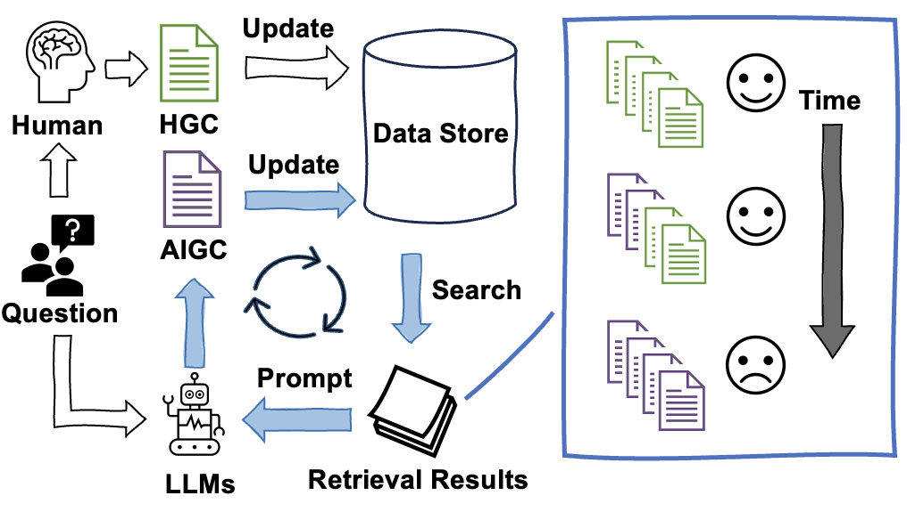

# Codebase of "Spiral of Silence: How is Large Language Model Killing Information Retrieval?—A Case Study on Open Domain Question Answering"
<details>
  <summary>Table of Contents</summary>
  <ol>
    <li><a href="#news-and-updates">News and Updates</a></li>
    <li><a href="#introduction">Introduction</a></li>
    <li><a href="#installation">Installation</a></li>
    <li><a href="#usage">Usage</a></li>
    <li><a href="#evaluation">Evaluation</a></li>
    <li><a href="#more-use-examples">More Use Examples</a></li> 
  </ol>
</details>

<!-- News and Updates -->

## News and Updates
- [05/15/2024] 🎉 Our paper has been accepted to ACL 2024.
- [05/12/2024] 💻 Published code used in our experiments.


<!-- Introduction -->

## Introduction

In this study, we construct and iteratively run a simulation pipeline to deeply investigate the short-term and long-term effects of LLM text on RAG systems. [(Arxiv)](https://arxiv.org/pdf/2404.10496.pdf)




### What does our code currently provide?
<!--
1. 方便使用的迭代模拟工具：我们提供了一个易于使用的迭代模拟工具，通过融合ElasticSearch、LangChain和api-for-llm的功能，能够方便地加载数据集，选择各种LLM和检索排序模型和自动迭代模拟。
2. 支持多个数据集：包括但不限于Natural Questions, TriviaQA, WebQuestions, PopQA，通过将数据转化为jsonl格式，你可以使用本文的框架对任何数据进行实验。
3. 支持多种检索模型和重排序模型：BM25, Contriever，LLM-Embedder，BGE，UPR，MonoT5等。
4. 支持使用常用的LLM生成：gpt-3.5-turbo, chatglm3-6b, qwen-14b-chat, llama2-13b-chat, baichuan2-13b-chat等。
5. 支持多种RAG pipeline演变评估方法，对每次实验的大量结果进行自动评价整理。
-->

1. **User-friendly Iteration Simulation Tool:** We offer an easy-to-use iteration simulation tool that integrates functionalities from [ElasticSearch](https://www.elastic.co/elasticsearch/), [LangChain](https://github.com/langchain-ai/langchain/), and [api-for-open-llm](https://github.com/xusenlinzy/api-for-open-llm), allowing for convenient dataset loading, selection of various LLMs and retrieval-ranking models, and automated iterative simulation.
2. **Support for Multiple Datasets:** Including but not limited to [Natural Questions](https://github.com/google-research-datasets/natural-questions), [TriviaQA](https://github.com/mandarjoshi90/triviaqa), [WebQuestions](https://github.com/brmson/dataset-factoid-webquestions), [PopQA](https://github.com/AlexTMallen/adaptive-retrieval). By converting data to jsonl format, you can use the framework in this paper to experiment with any data.
3. **Support for Various Retrieval and Re-ranking Models:** [BM25](https://python.langchain.com/docs/integrations/retrievers/elastic_search_bm25), [Contriever](https://github.com/facebookresearch/contriever), [LLM-Embedder](https://github.com/FlagOpen/FlagEmbedding), [BGE](https://github.com/FlagOpen/FlagEmbedding), [UPR](https://github.com/DevSinghSachan/unsupervised-passage-reranking), [MonoT5](https://github.com/castorini/pygaggle) and more.
4. **Support for frequently-used LLMs:** [GPT-3.5 turbo](https://openai.com/blog/gpt-3-5-turbo-fine-tuning-and-api-updates), [chatglm3-6b](https://huggingface.co/THUDM/chatglm3-6b), [Qwen-14B-Chat](https://huggingface.co/Qwen/Qwen-14B-Chat), [Llama-2-13b-chat-hf](https://huggingface.co/meta-llama/Llama-2-13b-chat-hf), [Baichuan2-13B-Chat](https://huggingface.co/baichuan-inc/Baichuan2-13B-Chat).
5. **Supports Various RAG Pipeline Evolution Evaluation Methods:** Automatically organizes and assesses the vast amount of results from each experiment.


<!-- GETTING STARTED -->

## Installation
<!-- 
我们的框架依赖ElasticSearch 8.11.1和api-for-open-llm，因此需要先安装这两个工具。我们建议您下载相同版本的[ElasticSearch 8.11.1](https://www.elastic.co/guide/en/elasticsearch/reference/8.11/targz.html)，并且在启动前从其config/elasticsearch.yml文件中设置好对应的http.port和http.host，它们将用于本仓库代码运行的配置。
当您安装api-for-open-llm时，请根据其[官方仓库](https://github.com/xusenlinzy/api-for-open-llm/blob/master/docs/SCRIPT.md)的指引，安装好运行您所需模型的依赖和环境。您在.env文件中设置的PORT也将作为本代码库需要的配置。
-->
Our framework depends on **ElasticSearch 8.11.1** and **api-for-open-llm**, therefore it is necessary to install these two tools first. We suggest downloading the same version of [ElasticSearch 8.11.1](https://www.elastic.co/guide/en/elasticsearch/reference/8.11/targz.html), and before starting, set the appropriate `http.port` and `http.host` in the `config/elasticsearch.yml` file, as these will be used for the configuration needed to run the code in this repository.

When installing api-for-open-llm, please follow the instructions provided by its [repository](https://github.com/xusenlinzy/api-for-open-llm/blob/master/docs/SCRIPT.md) to install all the dependencies and environment required to run the model you need. The `PORT` you configure in the `.env` file will also serve as a required configuration for this codebase.

### Install via GitHub

First, clone the repo:
```sh
git clone --recurse-submodules git@github.com:VerdureChen/SOS-Retrieval-Loop.git
```

Then, 

```sh
cd SOS-Retrieval-Loop
```

To install the required packages, you can create a conda environment:

```sh
conda create --name SOS_LOOP python=3.10
```

Activate the conda environment:

```sh
conda activate SOS_LOOP
```

then use pip to install required packages:

```sh
pip install -r requirements.txt
```

## Usage

Please see [Installation](#installation) to install the required packages.
<!-- 
在运行我们的框架之前，您需要先启动ElasticSearch和api-for-open-llm。在启动ElasticSearch时，您需要在其config/elasticsearch.yml文件中设置好对应的http.port和http.host，它们将用于本仓库代码运行的配置。
在启动api-for-open-llm时，您需要在.env文件中设置好PORT，它也将作为本代码库需要的配置。
-->
Before running our framework, you need to start **ElasticSearch** and **api-for-open-llm**. When starting **ElasticSearch**, you need to set the appropriate `http.port` and `http.host` in the `config/elasticsearch.yml` file, as these will be used for the configuration needed to run the code in this repository.

When starting **api-for-open-llm**, you need to set the `PORT` in the `.env` file, which will also serve as a required configuration for this codebase.

<!--
### Configuration
由于我们的代码涉及到较多的数据集、模型和索引等功能，我们使用三级config方式来控制代码的运行：
1. 在代码的特定功能（如检索、重排、生成等）目录下的config文件夹内，存放着该功能的配置文件模板，其中包含了所有可自行配置的参数，你可以从配置文件的文件名中确认该配置文件对应功能和数据集。例如，`src/retrieval_loop/retrieve_configs/bge-base-config-nq.json`是一个检索配置文件，对应的数据集是Natural Questions，使用的模型是BGE-base。我们以`src/retrieval_loop/index_configs/bge-base-config-psgs_w100.json`为例：
```json
{
      "new_text_file": "../../data_v2/input_data/DPR/psgs_w100.jsonl", 
      "retrieval_model": "bge-base",
      "index_name": "bge-base_faiss_index",
      "index_path": "../../data_v2/indexes",
      "index_add_path": "../../data_v2/indexes",
      "page_content_column": "contents",
      "index_exists": false,
      "normalize_embeddings": true,
      "query_files": ["../../data_v2/input_data/DPR/nq-test-h10.jsonl"],
      "query_page_content_column": "question",
      "output_files": ["../../data_v2/ret_output/DPR/nq-test-h10-bge-base"],
      "elasticsearch_url": "http://xxx.xxx.xxx.xxx:xxx"
}
```
其中，`new_text_file`是需要新添加到索引的文档路径，`retrieval_model`是使用的检索模型，`index_name`是索引的名称，`index_path`是索引的存储路径，`index_add_path`是索引的增量文档在索引中的ID存放路径（这对于我们需要从索引中删除特定文档特别有用），`page_content_column`是文档文件中待索引的文本的列名，`index_exists`指示索引是否已经存在（如果设置为false则会新建相应索引，否则从路径读取已存在的索引），`normalize_embeddings`是是否对检索模型的输出进行归一化，`query_files`是查询文件的路径，`query_page_content_column`是查询文件中查询文本的列名，`output_files`是输出检索结果文件的路径（与query_files一一对应），`elasticsearch_url`是ElasticSearch的url。
2. 由于我们通常需要在一个pipeline中融合多个步骤，与示例脚本`src/run_loop.sh`相适应的，我们提供一个全局配置文件`src/test_function/test_configs/template_total_config.json`，在这个全局配置文件中，你可以一次性对每个阶段的参数进行配置，你不必在其中配置所有参数，只需配置你相对于模板配置文件需要修改的参数即可。
3. 为了提升脚本运行效率，`src/run_loop.sh`脚本支持对于某个检索-重排方法，同时运行多个数据集和LLM生成的结果，为了能够更灵活地配置此类实验，我们支持在`src/run_loop.sh`内部通过`rewrite_configs.py`在pipeline运行过程中生成新的配置文件。例如，当我们需要循环运行pipeline时，我们需要记录每一轮的config内容，在每次进行检索之前，脚本将运行：
```bash
python ../rewrite_configs.py --total_config "${USER_CONFIG_PATH}" \
                          --method "${RETRIEVAL_MODEL_NAME}" \
                          --data_name "nq" \
                          --loop "${LOOP_NUM}" \
                          --stage "retrieval" \
                          --output_dir "${CONFIG_PATH}" \
                          --overrides '{"query_files": ['"${QUERY_FILE_LIST}"'], "output_files": ['"${OUTPUT_FILE_LIST}"'] , "elasticsearch_url": "'"${elasticsearch_url}"'", "normalize_embeddings": false}'
```
其中，`--total_config`是全局配置文件的路径，`--method`是检索方法的名称，`--data_name`是数据集的名称，`--loop`是当前循环的轮数，`--stage`是当前pipeline的阶段，`--output_dir`是新生成的配置文件的存储路径，`--overrides`是需要修改的参数（同样是每个任务config模板的子集）。
4. 在进行配置时你需要注意三类配置的优先级：第一级是每个任务config模板中的默认配置，第二级是全局配置文件，第三级是pipeline运行过程中生成的新配置文件。在pipeline运行过程中，第二级配置会覆盖第一级配置，第三级配置会覆盖第二级配置。
-->

### Configuration
Since our code involves many datasets, models, and index functionalities, we use a three-level config method to control the operation of the code:
1. In the config folder of the specific function (such as retrieval, re-ranking, generation, etc.), there is a configuration file template for that function, which contains all the parameters that can be configured by yourself. You can confirm the function and dataset corresponding to the configuration file from the file name of the configuration file. For example, `src/retrieval_loop/retrieve_configs/bge-base-config-nq.json` is a retrieval configuration file, corresponding to the Natural Questions dataset, and using the BGE-base model. We take `src/retrieval_loop/index_configs/bge-base-config-psgs_w100.json` as an example:
    
   ```json
    {
          "new_text_file": "../../data_v2/input_data/DPR/psgs_w100.jsonl", 
          "retrieval_model": "bge-base",
          "index_name": "bge-base_faiss_index",
          "index_path": "../../data_v2/indexes",
          "index_add_path": "../../data_v2/indexes",
          "page_content_column": "contents",
          "index_exists": false,
          "normalize_embeddings": true,
          "query_files": ["../../data_v2/input_data/DPR/nq-test-h10.jsonl"],
          "query_page_content_column": "question",
          "output_files": ["../../data_v2/ret_output/DPR/nq-test-h10-bge-base"],
          "elasticsearch_url": "http://xxx.xxx.xxx.xxx:xxx"
    }
    ```
   
    Where `new_text_file` is the path to the document to be newly added to the index, `retrieval_model` is the retrieval model used, `index_name` is the name of the index, `index_path` is the storage path of the index, `index_add_path` is the path where the ID of the incremental document in the index is stored (this is particularly useful when we need to delete specific documents from the index), `page_content_column` is the column name of the text to be indexed in the document file, `index_exists` indicates whether the index already exists (if set to false, the corresponding index will be created, otherwise the existing index will be read from the path), `normalize_embeddings` is whether to normalize the output of the retrieval model, `query_files` is the path to the query file, `query_page_content_column` is the column name of the query text in the query file, `output_files` is the path to the output retrieval result file (corresponding to query_files), and `elasticsearch_url` is the url of ElasticSearch.

2. Since we usually need to integrate multiple steps in a pipeline, corresponding to the example script `src/run_loop.sh`, we provide a global configuration file `src/test_function/test_configs/template_total_config.json`. In this global configuration file, you can configure the parameters of each stage at once. You do not need to configure all the parameters in it, just the parameters you need to modify relative to the template configuration file.

3. In order to improve the efficiency of script running, the `src/run_loop.sh` script supports running multiple datasets and LLM-generated results for a retrieval-re-ranking method at the same time. To flexibly configure such experiments, we support generating new configuration files during the pipeline run in `src/run_loop.sh` through `rewrite_configs.py`. For example, when we need to run the pipeline in a loop, we need to record the config content of each round. Before each retrieval, the script will run:
    
   ```bash
    python ../rewrite_configs.py --total_config "${USER_CONFIG_PATH}" \
                              --method "${RETRIEVAL_MODEL_NAME}" \
                              --data_name "nq" \
                              --loop "${LOOP_NUM}" \
                              --stage "retrieval" \
                              --output_dir "${CONFIG_PATH}" \
                              --overrides '{"query_files": ['"${QUERY_FILE_LIST}"'], "output_files": ['"${OUTPUT_FILE_LIST}"'] , "elasticsearch_url": "'"${elasticsearch_url}"'", "normalize_embeddings": false}'
    ```
   
    Where `--total_config` is the path to the global configuration file, `--method` is the name of the retrieval method, `--data_name` is the name of the dataset, `--loop` is the number of the current loop, `--stage` is the stage of the current pipeline, `--output_dir` is the storage path of the newly generated configuration file, and `--overrides` is the parameters that need to be modified (also a subset of the template configuration file for each task).

4. When configuring, you need to pay attention to the priority of the three types of configurations: the first level is the default configuration in each task config template, the second level is the global configuration file, and the third level is the new configuration file generated during the pipeline run. During the pipeline run, the second level configuration will override the first level configuration, and the third level configuration will override the second level configuration.


<!--
### Running the Code
通过以下步骤，你可以复现我们的实验，在此之前请阅读[Configuration](#configuration)部分了解配置文件的设置：
1. 数据集预处理：不论是查询还是文档，我们都需要将数据集转化为jsonl格式。我们的实验中使用data.wikipedia_split.psgs_w100数据，可参考[DPR仓库](https://github.com/facebookresearch/DPR?tab=readme-ov-file#resources--data-formats)的说明将其下载至`data_v2/raw_data/DPR`目录下并解压。我们提供一个简单的脚本`data_v2/gen_dpr_hc_jsonl.py`，可以将数据集转化为jsonl格式并放置于`data_v2/input_data/DPR`。实验中使用到的query文件位于`data_v2/input_data/DPR/sampled_query`。
   ```bash
    cd data_v2
    python gen_dpr_hc_jsonl.py 
    ```
2. 生成Zero-Shot RAG结果：使用`src/llm_zero_generate/run_generate.sh`，通过修改文件中的配置，能够批量化生成所有数据和模型的zero-shot RAG结果。在脚本开始位置配置如下参数：
    ```bash
    MODEL_NAMES=(chatglm3-6b) #chatglm3-6b qwen-14b-chat llama2-13b-chat baichuan2-13b-chat gpt-3.5-turbo
    GENERATE_BASE_AND_KEY=(
       "gpt-3.5-turbo http://XX.XX.XX.XX:XX/v1 xxx"
       "chatglm3-6b http://XX.XX.XX.XX:XX/v1 xxx"
       "qwen-14b-chat http://XX.XX.XX.XX:XX/v1 xxx"
       "llama2-13b-chat http://XX.XX.XX.XX:XX/v1 xxx"
       "baichuan2-13b-chat http://XX.XX.XX.XX:XX/v1 xxx"
      )
    
    DATA_NAMES=(tqa pop nq webq)
    CONTEXT_REF_NUM=1
    QUESTION_FILE_NAMES=(
      "-test-sample-200.jsonl"
      "-upr_rerank_based_on_bm25.json"
    )
    LOOP_CONFIG_PATH_NAME="../run_configs/original_retrieval_config"
    
    TOTAL_LOG_DIR="../run_logs/original_retrieval_log"
    QUESTION_FILE_PATH_TOTAL="../../data_v2/loop_output/DPR/original_retrieval_result"
    TOTAL_OUTPUT_DIR="../../data_v2/loop_output/DPR/original_retrieval_result"
    ```
    其中，`MODEL_NAMES`是需要生成结果的模型名称列表，`GENERATE_BASE_AND_KEY`由模型名称、api地址和key组成，`DATA_NAMES`是数据集名称列表，`CONTEXT_REF_NUM`是上下文参考数量（zero-shot情况下设置为0），`QUESTION_FILE_NAMES`是查询文件名称列表（但需要注意，脚本通过文件名的前缀识别其所属数据集，因此要查询nq-test-sample-200.jsonl，你需要在`DATA_NAMES`包含`nq`，而本字段则仅填写`-test-sample-200.jsonl`），`LOOP_CONFIG_PATH_NAME`和`TOTAL_LOG_DIR`分别是运行中config和日志的存储路径，`QUESTION_FILE_PATH_TOTAL`是查询文件存储路径，`TOTAL_OUTPUT_DIR`是生成结果存储路径。
    配置好后，运行脚本：
    ```bash
    cd src/llm_zero_generate
    bash run_generate.sh
    ```
3. 建立数据集索引：使用`src/retrieval_loop/run_index_builder.sh`，通过修改文件中的`MODEL_NAMES`和`DATA_NAMES`配置，能够一次性建立所有数据和模型的索引。你也可以通过配置`query_files`和`output_files`来获得基于该索引的对应方法的检索结果。在我们的实验中所有检索模型checkpoint放在`ret_model`目录下。
   运行：
   ```bash
    cd src/retrieval_loop
    bash run_index_builder.sh
   ```
4. 对Zero-Shot RAG生成的数据进行后处理，对生成的文本进行过滤、ID重命名等操作：使用`src/post_process/post_process.sh`，通过修改文件中的`MODEL_NAMES`和`QUERY_DATA_NAMES`配置，能够在一次运行中将所有数据和模型的zero-shot RAG生成结果。对于Zero-shot数据，我们将`LOOP_NUM`设置为0，`LOOP_CONFIG_PATH_NAME`,`TOTAL_LOG_DIR`,`TOTAL_OUTPUT_DIR`指定脚本configs,logs和output路径，如果不存在将自动生成。`FROM_METHOD`表示当前待处理的文本的生成方法，这将作为tag添加到处理后的文档ID中。`INPUT_FILE_PATH`为待处理的文本文件路径，其中每个包含每个数据集为名称的目录，目录下是各个Zero-shot结果文件。此外还需注意，核对`INPUT_FILE_NAME`与实际输入文本名一致。
    运行：
    ```bash
    cd src/post_process
    bash post_process.sh
    ```
5. 将Zero-Shot RAG生成的内容添加到索引，并获得加入Zero-Shot数据后的检索结果：使用`src/run_zero-shot.sh`，通过修改文件中的`GENERATE_MODEL_NAMES`和`QUERY_DATA_NAMES`配置，能够在一次运行中将所有数据和模型的zero-shot RAG生成结果添加到索引，并获得加入Zero-Shot数据后的检索结果。需要注意的是`run_items`列表表示了需要运行的检索-重排方法，其中每个元素构成例如`"item6 bm25 monot5"`，表明本次运行的第六个Zero-Shot RAG实验是基于BM25+MonoT5的检索-重排方法。
   运行：
   ```bash
   cd src
   bash run_zero-shot.sh
    ```
6. 运行主要的LLM-generated Text模拟循环：使用`src/run_loop.sh`，通过修改文件中的`GENERATE_MODEL_NAMES`和`QUERY_DATA_NAMES`配置，能够批量化运行所有数据和模型的LLM-generated Text模拟循环。你可以通过设置`TOTAL_LOOP_NUM`来控制循环次数，由于涉及到索引多次更新，每次只能运行一个检索-重排方法pipeline。如果你想改变RAG pipeline中LLM能看到的上下文个数，你可以通过修改`CONTEXT_REF_NUM`来实现，默认设置为5。
    运行：
    ```bash
    cd src
    bash run_loop.sh
    ```
-->

### Running the Code
Through the following steps, you can reproduce our experiments. Before that, please read the [Configuration](#configuration) section to understand the settings of the configuration file:
1. Dataset Preprocessing: Whether it is a query or a document, we need to convert the dataset to jsonl format. In our experiments, we use the data.wikipedia_split.psgs_w100 dataset, which can be downloaded to the `data_v2/raw_data/DPR` directory and unzipped according to the instructions in the [DPR repository](https://github.com/facebookresearch/DPR?tab=readme-ov-file#resources--data-formats). We provide a simple script `data_v2/gen_dpr_hc_jsonl.py`, which can convert the dataset to jsonl format and place it in `data_v2/input_data/DPR`. The query files used in the experiment are located in `data_v2/input_data/DPR/sampled_query`.
   ```bash
    cd data_v2
    python gen_dpr_hc_jsonl.py 
    ```
2. Generate Zero-Shot RAG Results: Use `src/llm_zero_generate/run_generate.sh`, by modifying the configuration in the file, you can generate zero-shot RAG results for all data and models in batches. Configure the following parameters at the beginning of the script:
    ```bash
    MODEL_NAMES=(chatglm3-6b) #chatglm3-6b qwen-14b-chat llama2-13b-chat baichuan2-13b-chat gpt-3.5-turbo
    GENERATE_BASE_AND_KEY=(
       "gpt-3.5-turbo http://XX.XX.XX.XX:XX/v1 xxx"
       "chatglm3-6b http://XX.XX.XX.XX:XX/v1 xxx"
       "qwen-14b-chat http://XX.XX.XX.XX:XX/v1 xxx"
       "llama2-13b-chat http://XX.XX.XX.XX:XX/v1 xxx"
       "baichuan2-13b-chat http://XX.XX.XX.XX:XX/v1 xxx"
      )
    DATA_NAMES=(tqa pop nq webq)
    CONTEXT_REF_NUM=1
    QUESTION_FILE_NAMES=(
      "-test-sample-200.jsonl"
      "-upr_rerank_based_on_bm25.json"
    )
    LOOP_CONFIG_PATH_NAME="../run_configs/original_retrieval_config"
    
    TOTAL_LOG_DIR="../run_logs/original_retrieval_log"
    QUESTION_FILE_PATH_TOTAL="../../data_v2/loop_output/DPR/original_retrieval_result"
    TOTAL_OUTPUT_DIR="../../data_v2/loop_output/DPR/original_retrieval_result"
    ```
    Where `MODEL_NAMES` is a list of model names for which results need to be generated, `GENERATE_BASE_AND_KEY` consists of the model name, api address, and key, `DATA_NAMES` is a list of dataset names, `CONTEXT_REF_NUM` is the number of context references (set to 0 in the zero-shot case), `QUESTION_FILE_NAMES` is a list of query file names (but note that the script identifies the dataset to which it belongs by the prefix of the file name, so to query nq-test-sample-200.jsonl, you need to include `nq` in `DATA_NAMES`, and this field only fills in `-test-sample-200.jsonl`), `LOOP_CONFIG_PATH_NAME` and `TOTAL_LOG_DIR` are the storage paths of the running config and logs, `QUESTION_FILE_PATH_TOTAL` is the query file storage path, and `TOTAL_OUTPUT_DIR` is the storage path of the generated results.
    After configuring, run the script:
    ```bash
    cd src/llm_zero_generate
    bash run_generate.sh
    ```
3. Build Dataset Index: Use `src/retrieval_loop/run_index_builder.sh`, by modifying the `MODEL_NAMES` and `DATA_NAMES` configuration in the file, you can build indexes for all data and models at once. You can also obtain retrieval results based on the corresponding method by configuring `query_files` and `output_files`. In our experiments, all retrieval model checkpoints are placed in the `ret_model` directory.
   Run:
   ```bash
    cd src/retrieval_loop
    bash run_index_builder.sh
   ```
4. Post-process the data generated by Zero-Shot RAG, filter the generated text, rename IDs, etc.: Use `src/post_process/post_process.sh`, by modifying the `MODEL_NAMES` and `QUERY_DATA_NAMES` configuration in the file, you can process all data and models of zero-shot RAG generation results in one run. For Zero-shot data, we set `LOOP_NUM` to 0, and `LOOP_CONFIG_PATH_NAME`, `TOTAL_LOG_DIR`, `TOTAL_OUTPUT_DIR` specify the paths of the script configs, logs, and output, respectively. `FROM_METHOD` indicates the generation method of the current text to be processed, which will be added as a tag to the processed document ID. `INPUT_FILE_PATH` is the path to the text file to be processed, with each directory containing the name of each dataset, and each directory containing various Zero-shot result files. In addition, make sure that `INPUT_FILE_NAME` is consistent with the actual input text name.
    Run:
    ```bash
    cd src/post_process
    bash post_process.sh
    ```
5. Add the content generated by Zero-Shot RAG to the index and obtain the retrieval results after adding Zero-Shot data: Use `src/run_zero-shot.sh`, by modifying the `GENERATE_MODEL_NAMES` and `QUERY_DATA_NAMES` configuration in the file, you can add the zero-shot RAG generation results of all data and models to the index in one run, and obtain the retrieval results after adding Zero-Shot data. Note that the `run_items` list indicates the retrieval-re-ranking methods that need to be run, where each element is constructed as `"item6 bm25 monot5"`, indicating that the sixth Zero-Shot RAG experiment in this run is based on the BM25+MonoT5 retrieval-re-ranking method.
   Run:
   ```bash
   cd src
   bash run_zero-shot.sh
    ```
6. Run the main LLM-generated Text simulation loop: Use `src/run_loop.sh`, by modifying the `GENERATE_MODEL_NAMES` and `QUERY_DATA_NAMES` configuration in the file, you can run the LLM-generated Text Simulation loop for all data and models in batches. You can control the number of loops by setting `TOTAL_LOOP_NUM`. Since it involves updating the index multiple times, only one retrieval-re-ranking method pipeline can be run at a time. If you want to change the number of contexts that LLM can see in the RAG pipeline, you can do so by modifying `CONTEXT_REF_NUM`, which is set to 5 by default.
   Run:
    ```bash
    cd src
    bash run_loop.sh
    ```
<!--
## Evaluation
面向实验中生成的大量数据，我们的框架支持多种批量化的评估方法，设置`src/evaluation/run_context_eva.sh`脚本中的`QUERY_DATA_NAMES`和`RESULT_NAMES`后，你可以选择任意可支持的task进行评估，包括：
1. `TASK="retrieval"`：对每次迭代的检索和重排序结果进行评估，包括Acc@5和Acc@20。
2. `TASK="QA"`：对每次迭代的QA结果进行评估，指标为EM。
3. `TASK="context_answer"`：计算每个LLM在每次迭代结束时回答正确（EM=1）或错误（EM=0）时上下文（默认为top5检索结果）中包含正确答案的文档数量。
4. `TASK="bleu"`：计算每次迭代上下文的SELF-BLEU值，默认计算2-gram和3-gram。
5. `TASK="percentage"`：计算每次迭代top5、20、50的上下文中各LLM和人类生成文本的百分比。
6. `TASK="misQA"`：在Misinformation实验中，计算每次迭代的QA结果中特定错误答案的EM。
7. `TASK="QA_llm_mis"`和`TASK="QA_llm_right"`：在Misinformation实验中，计算每次迭代的QA结果中特定错误答案或正确答案经过GPT-3.5-Turbo判别后确定文本确实支持该答案的情况（参考文中的EM_llm）。
8. `TASK="filter_bleu_*"`和`TASK="filter_source_*"`：在Filtering实验中，不同过滤方法下计算每次迭代的评估结果，*代表前面已经出现的评估内容（retireval, percentage, context_answer）。
评估后生成的结果文件默认存于对应`RESULT_DIR/RESULT_NAME/QUERY_DATA_NAME/results`目录下。
-->
## Evaluation
For the large amount of results generated in the experiment, our framework supports various batch evaluation methods. After setting `QUERY_DATA_NAMES` and `RESULT_NAMES` in `src/evaluation/run_context_eva.sh`, you can choose any supported task for evaluation, including:
1. `TASK="retrieval"`: Evaluate the retrieval and re-ranking results of each iteration, including Acc@5 and Acc@20.
2. `TASK="QA"`: Evaluate the QA results of each iteration (EM).
3. `TASK="context_answer"`: Calculate the number of documents in the contexts (default top 5 retrieval results) that contain the correct answer when each LLM answers correctly (EM=1) or incorrectly (EM=0) at the end of each iteration.
4. `TASK="bleu"`: Calculate the SELF-BLEU value of the contexts (default top 5 retrieval results) at each iteration, with 2-gram and 3-gram calculated by default.
5. `TASK="percentage"`: Calculate the percentage of each LLM and human-generated text in the top 5, 20, and 50 contexts at each iteration.
6. `TASK="misQA"`: In the Misinformation experiment, calculate the EM of specific incorrect answers in the QA results at each iteration.
7. `TASK="QA_llm_mis"` and `TASK="QA_llm_right"`: In the Misinformation experiment, calculate the situation where specific incorrect or correct answers in the QA results at each iteration are determined to be supported by the text after being judged by GPT-3.5-Turbo (refer to EM_llm in the paper).
8. `TASK="filter_bleu_*"` and `TASK="filter_source_*"`: In the Filtering experiment, calculate the evaluation results of each iteration under different filtering methods, where * represents the evaluation content that has already appeared (retrieval, percentage, context_answer).

The results generated after evaluation are stored by default in the corresponding `RESULT_DIR/RESULT_NAME/QUERY_DATA_NAME/results` directory.


<!--
## More Use Examples
### 在不同迭代阶段使用不同的LLM
通过修改`src/run_loop.sh`中的`GENERATE_MODEL_NAMES`配置，你可以在不同阶段使用不同的LLM，例如：
```bash
GENERATE_MODEL_NAMES_F3=(qwen-0.5b-chat qwen-1.8b-chat qwen-4b-chat)
GENERATE_MODEL_NAMES_F7=(qwen-7b-chat llama2-7b-chat baichuan2-7b-chat)
GENERATE_MODEL_NAMES_F10=(gpt-3.5-turbo qwen-14b-chat llama2-13b-chat)
```
表示在前三轮迭代中使用qwen-0.5b-chat、qwen-1.8b-chat和qwen-4b-chat，第四到七轮迭代中使用qwen-7b-chat、llama2-7b-chat和baichuan2-7b-chat，第八到十轮迭代中使用gpt-3.5-turbo、qwen-14b-chat和llama2-13b-chat。我们可以以此来模拟LLM性能随时间变化而增强时对RAG系统的影响。请记得在`GENERATE_BASE_AND_KEY`中提供对应的信息，同时修改`GENERATE_TASK`为`update_generate`。
### Misinformation实验
1. 我们首先使用GPT-3.5-Turbo为每个query生成5个错误答案,然后随机选取一个错误答案，令所有实验使用到的LLM为其生成支持文本。你可以修改`src/misinfo/mis_config`目录下的`{dataset}_mis_config_answer_gpt.json`配置文件（用于生成错误答案）和`{dataset}_mis_config_passage_{llm}.json`配置文件（用于生成包含错误答案的文本），对每个数据集和生成内容路径以及api信息进行配置.
2. 运行`src/misinfo/run_gen_misinfo.sh`脚本，能够在一次运行中生成所有数据和模型的Misinformation文本。
3. 参考[Running the Code](#running-the-code)中的步骤4到6，将生成的Misinformation文本添加到索引，并获得加入Misinformation数据后的RAG。
4. 参考[Evaluation](#evaluation)运行`src/evaluation/run_context_eva.sh`脚本，对Misinformation实验的结果进行评估，推荐使用`"retrieval"`,`"context_answer"`,`"QA_llm_mis"`,`"QA_llm_right"`评估任务。
### Filtering实验
在我们的实验中，我们分别进行了对检索获得的上下文的SELF-BLEU过滤和来源过滤。
1. SELF-BLEU过滤：我们计算top检索结果的SELF-BLEU值，确保输入给LLM的上下文维持较高的相似度（也就是较低的SELF-BLEU值，默认为0.4）。要启用此功能，将`src/run_loop.sh`中设置`FILTER_METHOD_NAME=filter_bleu`。
2. 来源过滤：我们识别top检索结果中来源于LLM的文本并将其排除。我们使用[Hello-SimpleAI/chatgpt-qa-detector-roberta](https://huggingface.co/Hello-SimpleAI/chatgpt-qa-detector-roberta)进行识别，请在实验开始前将该checkpoint放置于`ret_model`目录下。要启用此功能，将`src/run_loop.sh`中设置`FILTER_METHOD_NAME=filter_source`。
3. 参考[Evaluation](#evaluation)运行`src/evaluation/run_context_eva.sh`脚本，对Filtering实验的结果进行评估，推荐使用`"retrieval"`,`"QA"`,`"filter_bleu_*"`,`"filter_source_*"`评估任务。
### 从索引删除相应文档
由于我们的实验涉及到索引的动态更新，我们不可能在每次模拟中重新从零构造索引。相反地，在每次模拟时，我们都会将新增文本ID记录在`src/run_logs`中对应此次实验的`index_add_logs`目录下，待实验结束后，我们通过`src/post_process/delete_doc_from_index.py`脚本删除索引中的相应文档。
1. 当需要删除BM25索引中的文档时，运行：
```bash
cd src/post_process
python delete_doc_from_index.py --config_file_path delete_configs/delete_config_bm25.json
```
其中，`src/post_process/delete_configs/delete_config_bm25.json`是对应配置文件，其中包含参数：
```json
{
    "id_files": ["../run_logs/zero-shot_retrieval_log_low/index_add_logs"],
    "model_name": "bm25",
    "index_path": "../../data_v2/indexes",
    "index_name": "bm25_psgs_index",
    "elasticsearch_url": "http://xxx.xxx.xxx.xxx:xxx",
    "delete_log_path": "../run_logs/zero-shot_retrieval_log_low/index_add_logs"
}
```
其中，`id_files`是需要删除的文档ID所在文件目录，`model_name`是索引模型名称，`index_path`是索引存储路径，`index_name`是索引名称，`elasticsearch_url`是ElasticSearch的url，`delete_log_path`是删除文档ID记录的存储路径。不同索引的ID文件可以混合放置在同个目录下，脚本将自动读取目录下对应该索引的文档ID，并删除索引中的文档。
2. 当需要删除Faiss索引中的文档时，运行：
```bash
cd src/post_process
python delete_doc_from_index.py --config_file_path delete_configs/delete_config_faiss.json
```
其中，`src/post_process/delete_configs/delete_config_faiss.json`是对应配置文件，其中包含参数：
```json
{
     "id_files": ["../run_logs/mis_filter_bleu_nq_webq_pop_tqa_loop_log_contriever_None_total_loop_10_20240206164013/index_add_logs"],
    "model_name": "faiss",
    "index_path": "../../data_v2/indexes",
    "index_name": "contriever_faiss_index",
    "elasticsearch_url": "http://xxx.xxx.xxx.xxx:xxx",
    "delete_log_path": "../run_logs/mis_filter_bleu_nq_webq_pop_tqa_loop_log_contriever_None_total_loop_10_20240206164013/index_add_logs"
}
```
其中，`id_files`是需要删除的文档ID所在文件目录，`model_name`是索引模型名称，`index_path`是索引存储路径，`index_name`是索引名称，`elasticsearch_url`是ElasticSearch的url，`delete_log_path`是删除文档ID记录的存储路径。
-->
## More Use Examples
### Using Different LLMs at Different Iteration Stages
By modifying the `GENERATE_MODEL_NAMES` configuration in `src/run_loop.sh`, you can use different LLMs at different stages. For example:
```bash
GENERATE_MODEL_NAMES_F3=(qwen-0.5b-chat qwen-1.8b-chat qwen-4b-chat)
GENERATE_MODEL_NAMES_F7=(qwen-7b-chat llama2-7b-chat baichuan2-7b-chat)
GENERATE_MODEL_NAMES_F10=(gpt-3.5-turbo qwen-14b-chat llama2-13b-chat)
```
Indicates that qwen-0.5b-chat, qwen-1.8b-chat, and qwen-4b-chat are used in the first three rounds of iteration, qwen-7b-chat, llama2-7b-chat, and baichuan2-7b-chat are used in the fourth to seventh rounds of iteration, and gpt-3.5-turbo, qwen-14b-chat, and llama2-13b-chat are used in the eighth to tenth rounds of iteration. 

We can use this to simulate the impact of LLM performance enhancement over time on the RAG system. Remember to provide the corresponding information in `GENERATE_BASE_AND_KEY`, and modify `GENERATE_TASK` to `update_generate`.

### Misinformation Experiment
1. We first use GPT-3.5-Turbo to generate 5 incorrect answers for each query, and then randomly select an incorrect answer, and let all LLMs used in the experiment generate supporting text for it. You can modify the `{dataset}_mis_config_answer_gpt.json` configuration file (used to generate incorrect answers) and `{dataset}_mis_config_passage_{llm}.json` configuration file (used to generate text containing incorrect answers) in the `src/misinfo/mis_config` directory to configure each dataset and generation content path and api information.
2. Run the `src/misinfo/run_gen_misinfo.sh` script to generate Misinformation text for all data and models in one run.
3. Refer to [Running the Code](#running-the-code) steps 4 to 6 to add the generated Misinformation text to the index and obtain the RAG after adding Misinformation data.
4. Refer to [Evaluation](#evaluation) to run the `src/evaluation/run_context_eva.sh` script to evaluate the results of the Misinformation experiment, and it is recommended to use the `"retrieval"`, `"context_answer"`, `"QA_llm_mis"`, and `"QA_llm_right"` evaluation tasks.

### Filtering Experiment
In our experiments, we conducted SELF-BLEU filtering and source filtering of the retrieved contexts separately.
1. **SELF-BLEU filtering**: We calculate the SELF-BLEU value of the top retrieval results to ensure that the context input to the LLM maintains a high degree of similarity (i.e., a low SELF-BLEU value, default is 0.4). To enable this feature, set `FILTER_METHOD_NAME=filter_bleu` in `src/run_loop.sh`.
2. **Source filtering**: We identify text from the LLM in the top retrieval results and exclude it. We use [Hello-SimpleAI/chatgpt-qa-detector-roberta](https://huggingface.co/Hello-SimpleAI/chatgpt-qa-detector-roberta) for identification. Please place the checkpoint in the `ret_model` directory before the experiment starts. To enable this feature, set `FILTER_METHOD_NAME=filter_source` in `src/run_loop.sh`.
3. Refer to [Evaluation](#evaluation) to run the `src/evaluation/run_context_eva.sh` script to evaluate the results of the Filtering experiment, and it is recommended to use the `"retrieval"`, `"QA"`, `"filter_bleu_*"`, and `"filter_source_*"` evaluation tasks.

### Deleting Corresponding Documents from the Index
Since our experiments involve dynamic updates of the index, it is not possible to reconstruct the index from scratch in each simulation. Instead, in each simulation, we record the IDs of the newly added text in the `src/run_logs` directory under the `index_add_logs` directory corresponding to this experiment. After the experiment is over, we delete the corresponding documents from the index using the `src/post_process/delete_doc_from_index.py` script.
1. When you need to delete documents from the BM25 index, run:
```bash
cd src/post_process
python delete_doc_from_index.py --config_file_path delete_configs/delete_config_bm25.json
```
Where `src/post_process/delete_configs/delete_config_bm25.json` is the corresponding configuration file, which contains parameters:
```json
{
    "id_files": ["../run_logs/zero-shot_retrieval_log_low/index_add_logs"],
    "model_name": "bm25",
    "index_path": "../../data_v2/indexes",
    "index_name": "bm25_psgs_index",
    "elasticsearch_url": "http://xxx.xxx.xxx.xxx:xxx",
    "delete_log_path": "../run_logs/zero-shot_retrieval_log_low/index_add_logs"
}
```
Where `id_files` is the directory where the document IDs to be deleted are located, `model_name` is the index model name, `index_path` is the index storage path, `index_name` is the index name, `elasticsearch_url` is the url of ElasticSearch, and `delete_log_path` is the storage path of the document ID record. The ID files of different indexes can be mixed in the same directory, and the script will automatically read the document IDs corresponding to the index in the directory and delete the documents from the index.

2. When you need to delete documents from the Faiss index, run:
```bash
cd src/post_process
python delete_doc_from_index.py --config_file_path delete_configs/delete_config_faiss.json
```
Where `src/post_process/delete_configs/delete_config_faiss.json` is the corresponding configuration file, which contains parameters:
```json
{
     "id_files": ["../run_logs/mis_filter_bleu_nq_webq_pop_tqa_loop_log_contriever_None_total_loop_10_20240206164013/index_add_logs"],
    "model_name": "faiss",
    "index_path": "../../data_v2/indexes",
    "index_name": "contriever_faiss_index",
    "elasticsearch_url": "http://xxx.xxx.xxx.xxx:xxx",
    "delete_log_path": "../run_logs/mis_filter_bleu_nq_webq_pop_tqa_loop_log_contriever_None_total_loop_10_20240206164013/index_add_logs"
}
```
Where `id_files` is the directory where the document IDs to be deleted are located, `model_name` is the index model name, `index_path` is the index storage path, `index_name` is the index name, `elasticsearch_url` is the url of ElasticSearch, and `delete_log_path` is the storage path of the document ID record.
